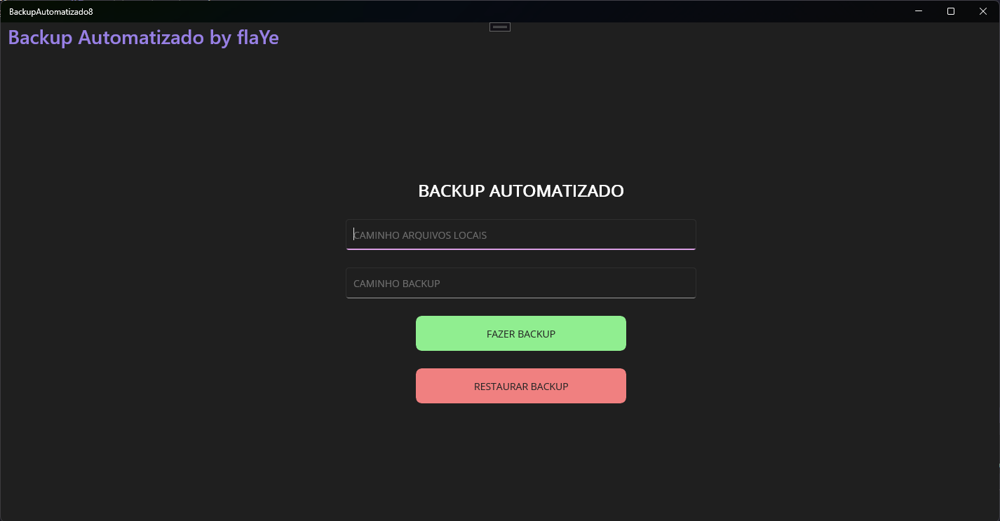

# Backup Automatizado by flaYe

### Aplicação simples para automatizar backups que normalmente são chatos e demorados, agora você pode fazer isso com apenas alguns cliques

  
  
  

  

## Interface de Usuário

### Campos de Entrada

1. **Caminho Arquivos Locais**
   - Descrição: Campo onde o usuário deve inserir o caminho dos arquivos locais que deseja fazer o backup.
   - Exemplo: `C:\Users\SeuUsuario\Documentos`

2. **Caminho Backup**
   - Descrição: Campo onde o usuário deve inserir o caminho do diretório onde o backup será armazenado.
   - Exemplo: `D:\Backup\`

### Botões de Ação

1. **Fazer Backup**
   - Descrição: Botão verde que inicia o processo de backup dos arquivos do caminho especificado no campo "Caminho Arquivos Locais" para o diretório especificado no campo "Caminho Backup".
   
2. **Restaurar Backup**
   - Descrição: Botão vermelho que restaura os arquivos de backup do diretório especificado no campo "Caminho Backup" para o caminho especificado no campo "Caminho Arquivos Locais".

## Uso

Para usar a aplicação, siga os seguintes passos:

1. **Inserir Caminho dos Arquivos Locais**
   - Digite ou cole o caminho dos arquivos que deseja fazer o backup no campo "Caminho Arquivos Locais".

2. **Inserir Caminho do Backup**
   - Digite ou cole o caminho do diretório onde deseja armazenar o backup no campo "Caminho Backup".

3. **Iniciar Backup**
   - Clique no botão verde "Fazer Backup" para iniciar o processo de backup.

4. **Restaurar Backup**
   - Caso precise restaurar os arquivos, insira os caminhos nos campos apropriados e clique no botão vermelho "Restaurar Backup".

## Captura de Tela

